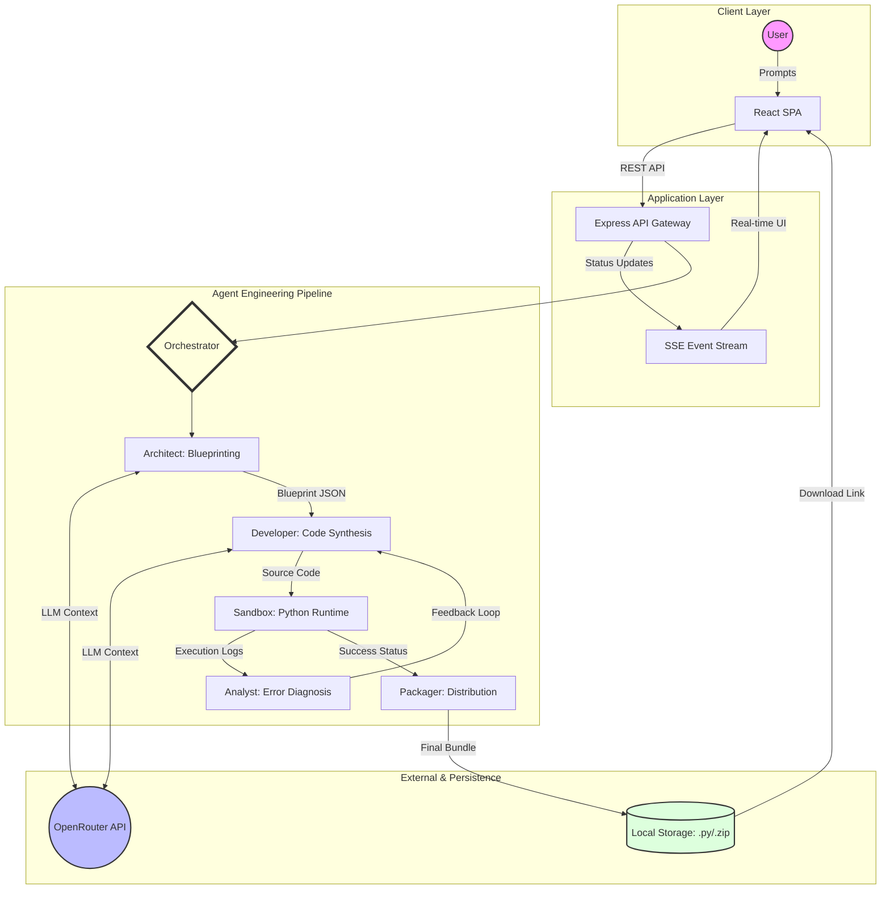

# AgentForge

AgentForge is an automated pipeline designed to architect, generate, test, and package AI agents based on high-level natural language descriptions. The system leverages large language models to handle the entire software development lifecycle of a specialized agent, including dependency management and self-healing through iterative error analysis.

## System Architecture

## Core Features

The application manages a complex multi-stage workflow to ensure the generated code is functional and ready for deployment.

The architecture stage analyzes the user prompt to define the agent name, required python dependencies, tool definitions, and specific test cases. This blueprint serves as the technical specification for all subsequent stages.

The development stage transforms the blueprint into a modular Python implementation. It automatically handles the integration of required libraries and follows the structural requirements defined in the blueprint.

The verification stage executes the generated code within a controlled sandbox environment. It runs the predefined test cases and captures stdout, stderr, and return codes to validate the logic.

The self-healing mechanism triggers if the verification stage detects failures or crashes. The system sends the error logs back to the language model to diagnose the root cause and generate a corrected version of the code, repeating the cycle until the tests pass.

The packaging stage bundles the final verified code, a generated requirements.txt file, and a customized README.md into a structured directory. This directory is then compressed into a ZIP archive for easy download and distribution.

## Technology Stack

The backend is built with Node.js and Express, using Server-Sent Events to stream real-time pipeline progress to the client. It manages child processes for Python execution and file system operations for agent persistence.

The frontend is a modern React application built with Vite. It features a real-time status tracker, a specialized code viewer with syntax highlighting via PrismJS, and interactive execution consoles to monitor the agent's performance.

The intelligence layer utilizes the OpenRouter API to access advanced language models that drive the decision-making, code generation, and error analysis processes.

## Project Structure

backend
Contains the Express server and pipeline logic.
Includes specialized prompts for orchestration, code generation, and diagnostics.
The isolated environment for running and testing generated Python code.
Utility functions for file management, path resolution, and packaging.

frontend
The React source code including hooks for SSE management and UI components.
Custom CSS for the AgentForge design system.
The production-ready build output.

## Installation and Setup

To run the system locally, ensure you have Node.js and Python 3 installed on your machine.

Clone the repository and install dependencies for both the backend and frontend.

Backend setup
cd backend
npm install
Create a .env file in the backend directory with your OPENROUTER_API_KEY.

Frontend setup
cd frontend
npm install
npm run dev

## Environment Variables

The backend requires the following configuration in a .env file:
PORT: The port the server will run on (defaults to 3001).
OPENROUTER_API_KEY: Your API key for model access.
FRONTEND_URL: The URL of the frontend for CORS configuration.

The frontend uses Vite environment variables:
VITE_API_BASE_URL: The base URL of the backend API.

## Deployment

The system is configured for deployment on Render using the included render.yaml blueprint.

The frontend should be deployed as a Static Site with the root directory set to frontend and the build command set to npm run build.

The backend should be deployed as a Web Service with the root directory set to backend and the start command set to npm start.

Ensure that the environment variables are correctly mapped between the two services to allow cross-origin communication and API access.
