<div align="center">

# AgentForge

[]()
[]()
[]()
[]()

AgentForge is a sophisticated autonomous pipeline designed to architect, generate, verify, and package specialized AI agents. By leveraging high-density language models, it manages the full software development lifecycle from natural language intent to pass-verified, production-ready distribution bundles.

</div>

## System Architecture

The following diagram illustrates the multi-layered communication between the client interface, the orchestration server, and the iterative generation pipeline.

<div align="center">
  
</div>

## Key Capabilities

| Phase | Description |
| :--- | :--- |
| **Architectural Blueprinting** | Analyzes natural language intent to generate technical specifications, including class hierarchies, dependencies, and validation test cases. |
| **Iterative Synthesis** | Generates modular Python implementations based on the architectural blueprint, ensuring strict adherence to the specified interfaces. |
| **Sandbox Verification** | Executes generated code in a secure, isolated environment to perform runtime validation and unit testing. |
| **Autonomous Self-Healing** | Dynamically analyzes stack traces and execution errors, feeding diagnostic data back into the LLM for automated logic correction. |
| **Distribution Packaging** | Aggregates verified source code, dependency manifests, and documentation into a finalized, ready-to-use distribution bundle. |

## Technology Stack

The platform is engineered using a decoupled architecture to ensure scalability and reliability.

| Component | Technology | Role |
| :--- | :--- | :--- |
| **Core Engine** | Node.js / Express | Orchestration, SSE management, and process isolation. |
| **Interface** | React / Vite | Real-time monitoring, state management, and code visualization. |
| **Intelligence** | OpenRouter API | Access to GPT-4/3.5 models for code generation and diagnostics. |
| **Formatting** | PrismJS | Specialized syntax highlighting for generated agent code. |
| **Runtime** | Python 3 | Target environment for agent execution and verification. |

## Project Structure

The codebase is organized into distinct modules for clear separation of concerns.

### Backend Module
*   `pipeline.js`: The central orchestrator managing the state machine from blueprint to package.
*   `prompts/`: A repository of specialized system prompts for synthesis and diagnostics.
*   `sandbox/`: The isolated environment responsible for process-level agent execution.
*   `utils/`: Core utilities for path resolution, schema validation, and file persistence.

### Frontend Module
*   `src/hooks/`: Custom React hooks for Server-Sent Event (SSE) stream management.
*   `src/components/`: Modular UI elements for the execution console and status tracking.
*   `assets/`: Project-level visual assets and documentation diagrams.

## Installation and Setup

### Local Development Environment

1.  **Repository Setup**
    ```bash
    git clone https://github.com/TinkerTechie/AutoAgent.git
    cd AutoAgent
    ```

2.  **Backend Initialization**
    ```bash
    cd backend
    npm install
    # Configure OPENROUTER_API_KEY in .env
    npm start
    ```

3.  **Frontend Initialization**
    ```bash
    cd ../frontend
    npm install
    npm run dev
    ```

## Environment Configuration

The system relies on specific environment variables for cross-service communication.

### Backend Configuration (.env)
*   `PORT`: Server listener port (Default: 3001).
*   `OPENROUTER_API_KEY`: Authentication key for model access.
*   `FRONTEND_URL`: CORS-authorized origin for the client application.

### Frontend Configuration (.env.production)
*   `VITE_API_BASE_URL`: The endpoint of the deployed backend API.

## Deployment Strategy

AgentForge is production-ready for the Render ecosystem using the provided `render.yaml` configuration.

*   **Frontend**: Deployed as a **Static Site** targeting the `frontend/dist` directory.
*   **Backend**: Deployed as a **Web Service** running the Node.js runtime.

All cross-service environment variables must be synchronized in the Render dashboard to ensure secure and valid API communication.
